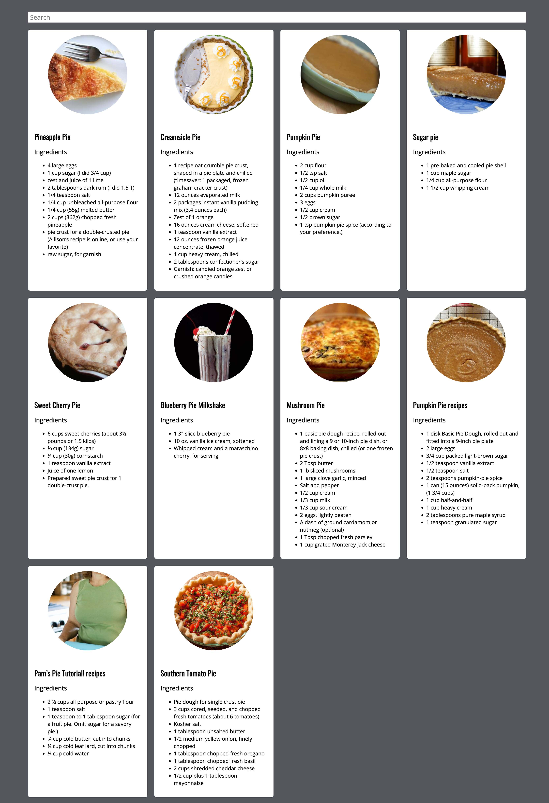

# Recipes App

An (unfinished) recipes app for testing out fetch, api calls and whatnot. Search is not yet implemented (Oct. 2022)

## Run details

Add API details to `./api_key.js` in the root directory

Start node express instance:
```bash
node app.js
```

Visit `http://localhost:3000/`

## Recipe Data

Recipe data comes from `pies.json` and can be pulled/updated using the `/load-recipes` route. This route causes a refresh of data from our recipe API source `https://api.edamam.com/`

### Screenshot


